# Projects and dependencies analysis

This document provides a comprehensive overview of the projects and their dependencies in the context of upgrading to .NETCoreApp,Version=v10.0.

## Table of Contents

- [Executive Summary](#executive-Summary)
  - [Highlevel Metrics](#highlevel-metrics)
  - [Projects Compatibility](#projects-compatibility)
  - [Package Compatibility](#package-compatibility)
  - [API Compatibility](#api-compatibility)
- [Aggregate NuGet packages details](#aggregate-nuget-packages-details)
- [Top API Migration Challenges](#top-api-migration-challenges)
  - [Technologies and Features](#technologies-and-features)
  - [Most Frequent API Issues](#most-frequent-api-issues)
- [Projects Relationship Graph](#projects-relationship-graph)
- [Project Details](#project-details)

  - [CalculatorTests\CalculatorTests.csproj](#calculatortestscalculatortestscsproj)
  - [ExampleCalculatorApp\ExampleCalculatorApp.csproj](#examplecalculatorappexamplecalculatorappcsproj)
  - [ExampleCodeGenApp\ExampleCodeGenApp.csproj](#examplecodegenappexamplecodegenappcsproj)
  - [ExampleShaderEditorApp\ExampleShaderEditorApp.csproj](#exampleshadereditorappexampleshadereditorappcsproj)
  - [NodeNetwork.Blazor\NodeNetwork.Blazor.csproj](#nodenetworkblazornodenetworkblazorcsproj)
  - [NodeNetwork\NodeNetwork.csproj](#nodenetworknodenetworkcsproj)
  - [NodeNetworkTests\NodeNetworkTests.csproj](#nodenetworktestsnodenetworktestscsproj)
  - [NodeNetworkToolkit.Blazor\NodeNetworkToolkit.Blazor.csproj](#nodenetworktoolkitblazornodenetworktoolkitblazorcsproj)
  - [NodeNetworkToolkit\NodeNetworkToolkit.csproj](#nodenetworktoolkitnodenetworktoolkitcsproj)
  - [StressTest\StressTest.csproj](#stressteststresstestcsproj)

## Executive Summary

### Highlevel Metrics

| Metric | Count | Status |
| :--- | :---: | :--- |
| Total Projects | 10 | 8 require upgrade |
| Total NuGet Packages | 26 | 3 need upgrade |
| Total Code Files | 216 |  |
| Total Code Files with Incidents | 111 |  |
| Total Lines of Code | 17622 |  |
| Total Number of Issues | 3087 |  |
| Estimated LOC to modify | 3029+ | at least 17,2% of codebase |

### Projects Compatibility

| Project | Target Framework | Difficulty | Package Issues | API Issues | Est. LOC Impact | Description |
| :--- | :---: | :---: | :---: | :---: | :---: | :--- |
| [CalculatorTests\CalculatorTests.csproj](#calculatortestscalculatortestscsproj) | net6.0-windows | 🟢 Low | 0 | 0 |  | Wpf, Sdk Style = True |
| [ExampleCalculatorApp\ExampleCalculatorApp.csproj](#examplecalculatorappexamplecalculatorappcsproj) | net6.0-windows | 🟡 Medium | 8 | 41 | 41+ | Wpf, Sdk Style = True |
| [ExampleCodeGenApp\ExampleCodeGenApp.csproj](#examplecodegenappexamplecodegenappcsproj) | net6.0-windows | 🟡 Medium | 8 | 403 | 403+ | Wpf, Sdk Style = True |
| [ExampleShaderEditorApp\ExampleShaderEditorApp.csproj](#exampleshadereditorappexampleshadereditorappcsproj) | net6.0-windows | 🟡 Medium | 8 | 261 | 261+ | Wpf, Sdk Style = True |
| [NodeNetwork.Blazor\NodeNetwork.Blazor.csproj](#nodenetworkblazornodenetworkblazorcsproj) | net10.0 | ✅ None | 0 | 0 |  | ClassLibrary, Sdk Style = True |
| [NodeNetwork\NodeNetwork.csproj](#nodenetworknodenetworkcsproj) | net6.0-windows;net472 | 🟡 Medium | 10 | 1614 | 1614+ | Wpf, Sdk Style = True |
| [NodeNetworkTests\NodeNetworkTests.csproj](#nodenetworktestsnodenetworktestscsproj) | net6.0-windows | 🟢 Low | 0 | 0 |  | Wpf, Sdk Style = True |
| [NodeNetworkToolkit.Blazor\NodeNetworkToolkit.Blazor.csproj](#nodenetworktoolkitblazornodenetworktoolkitblazorcsproj) | net10.0 | ✅ None | 0 | 0 |  | ClassLibrary, Sdk Style = True |
| [NodeNetworkToolkit\NodeNetworkToolkit.csproj](#nodenetworktoolkitnodenetworktoolkitcsproj) | net6.0-windows;net472 | 🟡 Medium | 8 | 668 | 668+ | Wpf, Sdk Style = True |
| [StressTest\StressTest.csproj](#stressteststresstestcsproj) | net6.0-windows | 🟡 Medium | 8 | 42 | 42+ | Wpf, Sdk Style = True |

### Package Compatibility

| Status | Count | Percentage |
| :--- | :---: | :---: |
| ✅ Compatible | 23 | 88,5% |
| ⚠️ Incompatible | 2 | 7,7% |
| 🔄 Upgrade Recommended | 1 | 3,8% |
| ***Total NuGet Packages*** | ***26*** | ***100%*** |

### API Compatibility

| Category | Count | Impact |
| :--- | :---: | :--- |
| 🔴 Binary Incompatible | 2930 | High - Require code changes |
| 🟡 Source Incompatible | 27 | Medium - Needs re-compilation and potential conflicting API error fixing |
| 🔵 Behavioral change | 72 | Low - Behavioral changes that may require testing at runtime |
| ✅ Compatible | 17521 |  |
| ***Total APIs Analyzed*** | ***20550*** |  |

## Aggregate NuGet packages details

| Package | Current Version | Suggested Version | Projects | Description |
| :--- | :---: | :---: | :--- | :--- |
| Extended.Wpf.Toolkit | 4.7.25104.5739 |  | [ExampleCalculatorApp.csproj](#examplecalculatorappexamplecalculatorappcsproj) [ExampleCodeGenApp.csproj](#examplecodegenappexamplecodegenappcsproj) [ExampleShaderEditorApp.csproj](#exampleshadereditorappexampleshadereditorappcsproj) | ✅Compatible |
| log4net | 3.1.0 |  | [NodeNetwork.csproj](#nodenetworknodenetworkcsproj) | ✅Compatible |
| MathNet.Numerics | 5.0.0 |  | [ExampleShaderEditorApp.csproj](#exampleshadereditorappexampleshadereditorappcsproj) | ✅Compatible |
| MathNet.Spatial | 0.6.0 |  | [ExampleShaderEditorApp.csproj](#exampleshadereditorappexampleshadereditorappcsproj) | ✅Compatible |
| Microsoft.AspNetCore.Components.Web | 10.0.3 |  | [NodeNetwork.Blazor.csproj](#nodenetworkblazornodenetworkblazorcsproj) | ✅Compatible |
| Microsoft.CSharp | 4.7.0 |  | [ExampleCalculatorApp.csproj](#examplecalculatorappexamplecalculatorappcsproj) [ExampleCodeGenApp.csproj](#examplecodegenappexamplecodegenappcsproj) [ExampleShaderEditorApp.csproj](#exampleshadereditorappexampleshadereditorappcsproj) [NodeNetwork.csproj](#nodenetworknodenetworkcsproj) [NodeNetworkToolkit.csproj](#nodenetworktoolkitnodenetworktoolkitcsproj) [StressTest.csproj](#stressteststresstestcsproj) | ✅Compatible |
| Microsoft.NET.Test.Sdk | 15.9.2 |  | [CalculatorTests.csproj](#calculatortestscalculatortestscsproj) [NodeNetworkTests.csproj](#nodenetworktestsnodenetworktestscsproj) | ✅Compatible |
| MoonSharp | 2.0.0.0 |  | [ExampleCodeGenApp.csproj](#examplecodegenappexamplecodegenappcsproj) | ✅Compatible |
| MSTest.TestAdapter | 3.9.3 |  | [CalculatorTests.csproj](#calculatortestscalculatortestscsproj) [NodeNetworkTests.csproj](#nodenetworktestsnodenetworktestscsproj) | ✅Compatible |
| MSTest.TestFramework | 3.9.3 |  | [CalculatorTests.csproj](#calculatortestscalculatortestscsproj) [NodeNetworkTests.csproj](#nodenetworktestsnodenetworktestscsproj) | ✅Compatible |
| OpenTK | 4.9.4 |  | [ExampleShaderEditorApp.csproj](#exampleshadereditorappexampleshadereditorappcsproj) | ✅Compatible |
| OpenTK.GLControl | 4.0.2 |  | [ExampleShaderEditorApp.csproj](#exampleshadereditorappexampleshadereditorappcsproj) | ✅Compatible |
| ReactiveUI | 20.4.1 |  | [CalculatorTests.csproj](#calculatortestscalculatortestscsproj) [ExampleCalculatorApp.csproj](#examplecalculatorappexamplecalculatorappcsproj) [ExampleCodeGenApp.csproj](#examplecodegenappexamplecodegenappcsproj) [ExampleShaderEditorApp.csproj](#exampleshadereditorappexampleshadereditorappcsproj) [NodeNetwork.csproj](#nodenetworknodenetworkcsproj) [NodeNetworkTests.csproj](#nodenetworktestsnodenetworktestscsproj) [NodeNetworkToolkit.csproj](#nodenetworktoolkitnodenetworktoolkitcsproj) [StressTest.csproj](#stressteststresstestcsproj) | ✅Compatible |
| ReactiveUI.Events.WPF | 15.1.1 |  | [NodeNetwork.csproj](#nodenetworknodenetworkcsproj) | ⚠️Das NuGet-Paket ist veraltet |
| ReactiveUI.Testing | 20.4.1 |  | [CalculatorTests.csproj](#calculatortestscalculatortestscsproj) [NodeNetworkTests.csproj](#nodenetworktestsnodenetworktestscsproj) | ✅Compatible |
| ReactiveUI.WPF | 20.4.1 | 16.4.15 | [NodeNetwork.csproj](#nodenetworknodenetworkcsproj) | ⚠️Das NuGet-Paket ist nicht kompatibel |
| Splat.Drawing | 13.1.63 |  | [NodeNetwork.csproj](#nodenetworknodenetworkcsproj) | ✅Compatible |
| System.Buffers | 4.6.1 |  | [ExampleCalculatorApp.csproj](#examplecalculatorappexamplecalculatorappcsproj) [ExampleCodeGenApp.csproj](#examplecodegenappexamplecodegenappcsproj) [ExampleShaderEditorApp.csproj](#exampleshadereditorappexampleshadereditorappcsproj) [NodeNetwork.csproj](#nodenetworknodenetworkcsproj) [NodeNetworkToolkit.csproj](#nodenetworktoolkitnodenetworktoolkitcsproj) [StressTest.csproj](#stressteststresstestcsproj) | Die Funktionalität des NuGet-Pakets ist im Frameworkverweis enthalten |
| System.Collections.Immutable | 9.0.7 | 10.0.3 | [ExampleCalculatorApp.csproj](#examplecalculatorappexamplecalculatorappcsproj) [ExampleCodeGenApp.csproj](#examplecodegenappexamplecodegenappcsproj) [ExampleShaderEditorApp.csproj](#exampleshadereditorappexampleshadereditorappcsproj) [NodeNetwork.csproj](#nodenetworknodenetworkcsproj) [NodeNetworkToolkit.csproj](#nodenetworktoolkitnodenetworktoolkitcsproj) [StressTest.csproj](#stressteststresstestcsproj) | Ein NuGet-Paketupgrade wird empfohlen |
| System.Data.DataSetExtensions | 4.5.0 |  | [ExampleCalculatorApp.csproj](#examplecalculatorappexamplecalculatorappcsproj) [ExampleCodeGenApp.csproj](#examplecodegenappexamplecodegenappcsproj) [ExampleShaderEditorApp.csproj](#exampleshadereditorappexampleshadereditorappcsproj) [NodeNetwork.csproj](#nodenetworknodenetworkcsproj) [NodeNetworkToolkit.csproj](#nodenetworktoolkitnodenetworktoolkitcsproj) [StressTest.csproj](#stressteststresstestcsproj) | Die Funktionalität des NuGet-Pakets ist im Frameworkverweis enthalten |
| System.Drawing.Primitives | 4.3.0 |  | [ExampleCalculatorApp.csproj](#examplecalculatorappexamplecalculatorappcsproj) [ExampleCodeGenApp.csproj](#examplecodegenappexamplecodegenappcsproj) [ExampleShaderEditorApp.csproj](#exampleshadereditorappexampleshadereditorappcsproj) [NodeNetwork.csproj](#nodenetworknodenetworkcsproj) [NodeNetworkToolkit.csproj](#nodenetworktoolkitnodenetworktoolkitcsproj) [StressTest.csproj](#stressteststresstestcsproj) | Die Funktionalität des NuGet-Pakets ist im Frameworkverweis enthalten |
| System.Memory | 4.6.3 |  | [ExampleCalculatorApp.csproj](#examplecalculatorappexamplecalculatorappcsproj) [ExampleCodeGenApp.csproj](#examplecodegenappexamplecodegenappcsproj) [ExampleShaderEditorApp.csproj](#exampleshadereditorappexampleshadereditorappcsproj) [NodeNetwork.csproj](#nodenetworknodenetworkcsproj) [NodeNetworkToolkit.csproj](#nodenetworktoolkitnodenetworktoolkitcsproj) [StressTest.csproj](#stressteststresstestcsproj) | Die Funktionalität des NuGet-Pakets ist im Frameworkverweis enthalten |
| System.Numerics.Vectors | 4.6.1 |  | [ExampleCalculatorApp.csproj](#examplecalculatorappexamplecalculatorappcsproj) [ExampleCodeGenApp.csproj](#examplecodegenappexamplecodegenappcsproj) [ExampleShaderEditorApp.csproj](#exampleshadereditorappexampleshadereditorappcsproj) [NodeNetwork.csproj](#nodenetworknodenetworkcsproj) [NodeNetworkToolkit.csproj](#nodenetworktoolkitnodenetworktoolkitcsproj) [StressTest.csproj](#stressteststresstestcsproj) | Die Funktionalität des NuGet-Pakets ist im Frameworkverweis enthalten |
| System.Runtime.CompilerServices.Unsafe | 6.1.2 |  | [ExampleCalculatorApp.csproj](#examplecalculatorappexamplecalculatorappcsproj) [ExampleCodeGenApp.csproj](#examplecodegenappexamplecodegenappcsproj) [ExampleShaderEditorApp.csproj](#exampleshadereditorappexampleshadereditorappcsproj) [NodeNetwork.csproj](#nodenetworknodenetworkcsproj) [NodeNetworkToolkit.csproj](#nodenetworktoolkitnodenetworktoolkitcsproj) [StressTest.csproj](#stressteststresstestcsproj) | ✅Compatible |
| System.Threading.Tasks.Extensions | 4.6.3 |  | [ExampleCalculatorApp.csproj](#examplecalculatorappexamplecalculatorappcsproj) [ExampleCodeGenApp.csproj](#examplecodegenappexamplecodegenappcsproj) [ExampleShaderEditorApp.csproj](#exampleshadereditorappexampleshadereditorappcsproj) [NodeNetwork.csproj](#nodenetworknodenetworkcsproj) [NodeNetworkToolkit.csproj](#nodenetworktoolkitnodenetworktoolkitcsproj) [StressTest.csproj](#stressteststresstestcsproj) | Die Funktionalität des NuGet-Pakets ist im Frameworkverweis enthalten |
| System.ValueTuple | 4.6.1 |  | [ExampleCalculatorApp.csproj](#examplecalculatorappexamplecalculatorappcsproj) [ExampleCodeGenApp.csproj](#examplecodegenappexamplecodegenappcsproj) [ExampleShaderEditorApp.csproj](#exampleshadereditorappexampleshadereditorappcsproj) [NodeNetwork.csproj](#nodenetworknodenetworkcsproj) [NodeNetworkToolkit.csproj](#nodenetworktoolkitnodenetworktoolkitcsproj) [StressTest.csproj](#stressteststresstestcsproj) | Die Funktionalität des NuGet-Pakets ist im Frameworkverweis enthalten |

## Top API Migration Challenges

### Technologies and Features

| Technology | Issues | Percentage | Migration Path |
| :--- | :---: | :---: | :--- |
| WPF (Windows Presentation Foundation) | 1221 | 40,3% | WPF APIs for building Windows desktop applications with XAML-based UI that are available in .NET on Windows. WPF provides rich desktop UI capabilities with data binding and styling. Enable Windows Desktop support: Option 1 (Recommended): Target net9.0-windows; Option 2: Add <UseWindowsDesktop>true</UseWindowsDesktop>. |
| Windows Forms | 28 | 0,9% | Windows Forms APIs for building Windows desktop applications with traditional Forms-based UI that are available in .NET on Windows. Enable Windows Desktop support: Option 1 (Recommended): Target net9.0-windows; Option 2: Add <UseWindowsDesktop>true</UseWindowsDesktop>; Option 3 (Legacy): Use Microsoft.NET.Sdk.WindowsDesktop SDK. |
| GDI+ / System.Drawing | 19 | 0,6% | System.Drawing APIs for 2D graphics, imaging, and printing that are available via NuGet package System.Drawing.Common. Note: Not recommended for server scenarios due to Windows dependencies; consider cross-platform alternatives like SkiaSharp or ImageSharp for new code. |
| Legacy Configuration System | 2 | 0,1% | Legacy XML-based configuration system (app.config/web.config) that has been replaced by a more flexible configuration model in .NET Core. The old system was rigid and XML-based. Migrate to Microsoft.Extensions.Configuration with JSON/environment variables; use System.Configuration.ConfigurationManager NuGet package as interim bridge if needed. |

### Most Frequent API Issues

| API | Count | Percentage | Category |
| :--- | :---: | :---: | :--- |
| T:System.Windows.Point | 264 | 8,7% | Binary Incompatible |
| T:System.Windows.DependencyProperty | 245 | 8,1% | Binary Incompatible |
| M:System.Windows.DependencyObject.SetValue(System.Windows.DependencyProperty,System.Object) | 80 | 2,6% | Binary Incompatible |
| M:System.Windows.DependencyObject.GetValue(System.Windows.DependencyProperty) | 80 | 2,6% | Binary Incompatible |
| T:System.Windows.Visibility | 70 | 2,3% | Binary Incompatible |
| T:System.Windows.Controls.TextBlock | 63 | 2,1% | Binary Incompatible |
| T:System.Windows.Vector | 62 | 2,0% | Binary Incompatible |
| T:System.Windows.Media.Brush | 61 | 2,0% | Binary Incompatible |
| T:System.Windows.Controls.ItemsControl | 59 | 1,9% | Binary Incompatible |
| T:System.Windows.Input.Key | 55 | 1,8% | Binary Incompatible |
| M:System.Windows.Controls.UserControl.#ctor | 44 | 1,5% | Binary Incompatible |
| P:System.Windows.Point.X | 43 | 1,4% | Binary Incompatible |
| T:System.Windows.Controls.Button | 40 | 1,3% | Binary Incompatible |
| T:System.Windows.Rect | 40 | 1,3% | Binary Incompatible |
| T:System.Uri | 38 | 1,3% | Behavioral Change |
| P:System.Windows.Point.Y | 38 | 1,3% | Binary Incompatible |
| T:System.Windows.DependencyObject | 37 | 1,2% | Binary Incompatible |
| T:System.Windows.Controls.MenuItem | 35 | 1,2% | Binary Incompatible |
| T:System.Windows.Application | 34 | 1,1% | Binary Incompatible |
| M:System.Uri.#ctor(System.String,System.UriKind) | 34 | 1,1% | Behavioral Change |
| T:System.Windows.Controls.TextBox | 34 | 1,1% | Binary Incompatible |
| T:System.Windows.Size | 34 | 1,1% | Binary Incompatible |
| T:System.Windows.Controls.Canvas | 31 | 1,0% | Binary Incompatible |
| M:System.Windows.Application.LoadComponent(System.Object,System.Uri) | 30 | 1,0% | Binary Incompatible |
| T:System.Windows.Markup.IComponentConnector | 29 | 1,0% | Binary Incompatible |
| M:System.Windows.Point.#ctor(System.Double,System.Double) | 26 | 0,9% | Binary Incompatible |
| P:System.Windows.UIElement.Visibility | 24 | 0,8% | Binary Incompatible |
| T:System.Windows.Controls.UserControl | 22 | 0,7% | Binary Incompatible |
| M:System.Windows.TemplatePartAttribute.#ctor | 22 | 0,7% | Binary Incompatible |
| T:System.Windows.TemplatePartAttribute | 22 | 0,7% | Binary Incompatible |
| M:System.Windows.FrameworkElement.GetTemplateChild(System.String) | 22 | 0,7% | Binary Incompatible |
| T:System.Windows.Media.Color | 21 | 0,7% | Binary Incompatible |
| T:System.Windows.IInputElement | 19 | 0,6% | Binary Incompatible |
| P:System.Windows.Controls.ItemsControl.ItemsSource | 19 | 0,6% | Binary Incompatible |
| P:System.Windows.Controls.TextBlock.Text | 18 | 0,6% | Binary Incompatible |
| P:System.Windows.FrameworkElement.DefaultStyleKey | 18 | 0,6% | Binary Incompatible |
| M:System.Windows.TemplateVisualStateAttribute.#ctor | 18 | 0,6% | Binary Incompatible |
| T:System.Windows.TemplateVisualStateAttribute | 18 | 0,6% | Binary Incompatible |
| T:System.Windows.VisualStateManager | 18 | 0,6% | Binary Incompatible |
| M:System.Windows.VisualStateManager.GoToState(System.Windows.FrameworkElement,System.String,System.Boolean) | 18 | 0,6% | Binary Incompatible |
| T:System.Windows.Controls.Image | 18 | 0,6% | Binary Incompatible |
| T:System.Windows.Controls.Primitives.Thumb | 18 | 0,6% | Binary Incompatible |
| T:System.Windows.ResourceDictionary | 17 | 0,6% | Binary Incompatible |
| P:System.Windows.FrameworkElement.Resources | 17 | 0,6% | Binary Incompatible |
| P:System.Windows.ResourceDictionary.Item(System.Object) | 17 | 0,6% | Binary Incompatible |
| T:System.Windows.Media.ScaleTransform | 17 | 0,6% | Binary Incompatible |
| T:System.Windows.Media.PathGeometry | 17 | 0,6% | Binary Incompatible |
| M:System.Windows.Vector.#ctor(System.Double,System.Double) | 17 | 0,6% | Binary Incompatible |
| P:System.Windows.Input.KeyEventArgs.Key | 17 | 0,6% | Binary Incompatible |
| T:System.Windows.Input.MouseEventArgs | 16 | 0,5% | Binary Incompatible |

## Projects Relationship Graph

Legend:
📦 SDK-style project
⚙️ Classic project

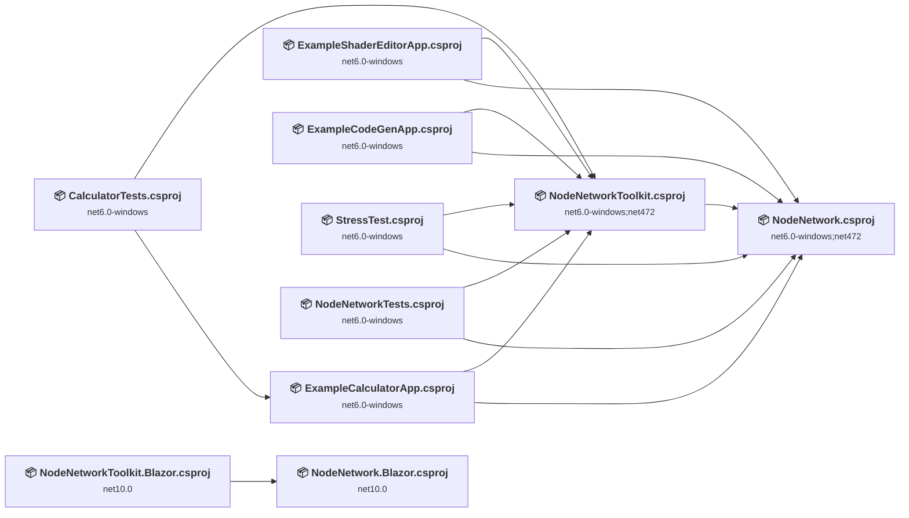

## Project Details

### CalculatorTests\CalculatorTests.csproj

#### Project Info

- **Current Target Framework:** net6.0-windows
- **Proposed Target Framework:** net10.0-windows
- **SDK-style**: True
- **Project Kind:** Wpf
- **Dependencies**: 2
- **Dependants**: 0
- **Number of Files**: 1
- **Number of Files with Incidents**: 1
- **Lines of Code**: 286
- **Estimated LOC to modify**: 0+ (at least 0,0% of the project)

#### Dependency Graph

Legend:
📦 SDK-style project
⚙️ Classic project

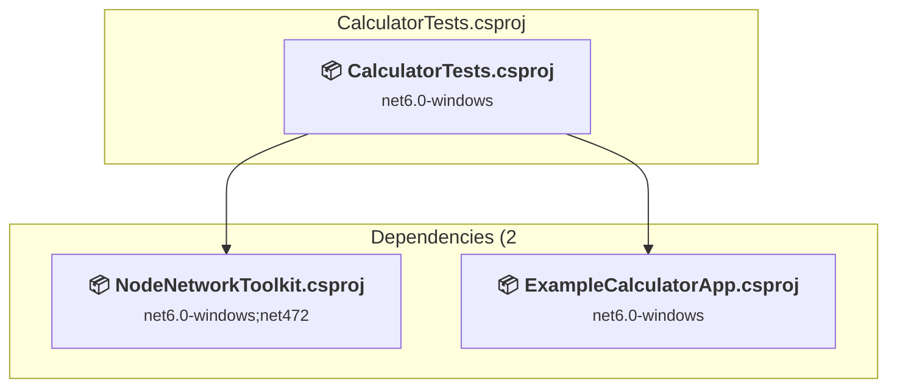

### API Compatibility

| Category | Count | Impact |
| :--- | :---: | :--- |
| 🔴 Binary Incompatible | 0 | High - Require code changes |
| 🟡 Source Incompatible | 0 | Medium - Needs re-compilation and potential conflicting API error fixing |
| 🔵 Behavioral change | 0 | Low - Behavioral changes that may require testing at runtime |
| ✅ Compatible | 718 |  |
| ***Total APIs Analyzed*** | ***718*** |  |

### ExampleCalculatorApp\ExampleCalculatorApp.csproj

#### Project Info

- **Current Target Framework:** net6.0-windows
- **Proposed Target Framework:** net10.0-windows
- **SDK-style**: True
- **Project Kind:** Wpf
- **Dependencies**: 2
- **Dependants**: 1
- **Number of Files**: 12
- **Number of Files with Incidents**: 7
- **Lines of Code**: 509
- **Estimated LOC to modify**: 41+ (at least 8,1% of the project)

#### Dependency Graph

Legend:
📦 SDK-style project
⚙️ Classic project

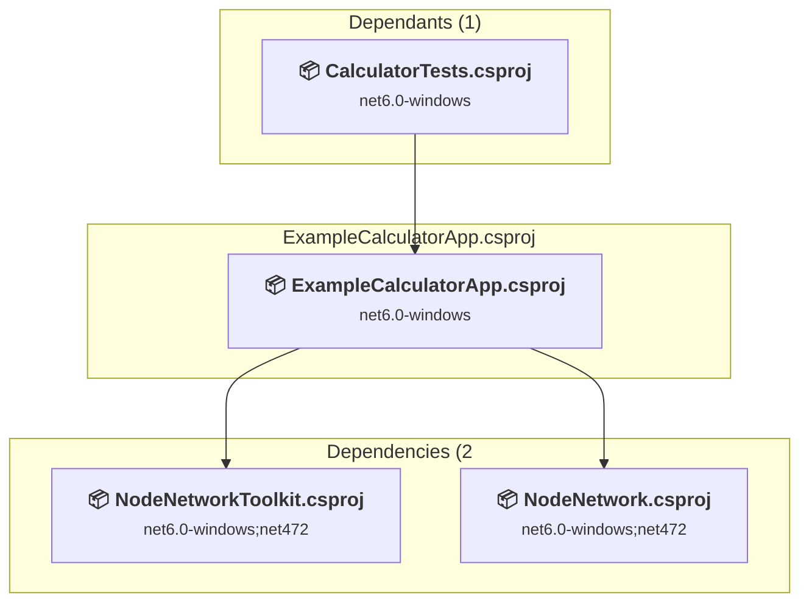

### API Compatibility

| Category | Count | Impact |
| :--- | :---: | :--- |
| 🔴 Binary Incompatible | 34 | High - Require code changes |
| 🟡 Source Incompatible | 0 | Medium - Needs re-compilation and potential conflicting API error fixing |
| 🔵 Behavioral change | 7 | Low - Behavioral changes that may require testing at runtime |
| ✅ Compatible | 621 |  |
| ***Total APIs Analyzed*** | ***662*** |  |

#### Project Technologies and Features

| Technology | Issues | Percentage | Migration Path |
| :--- | :---: | :---: | :--- |
| WPF (Windows Presentation Foundation) | 11 | 26,8% | WPF APIs for building Windows desktop applications with XAML-based UI that are available in .NET on Windows. WPF provides rich desktop UI capabilities with data binding and styling. Enable Windows Desktop support: Option 1 (Recommended): Target net9.0-windows; Option 2: Add <UseWindowsDesktop>true</UseWindowsDesktop>. |

### ExampleCodeGenApp\ExampleCodeGenApp.csproj

#### Project Info

- **Current Target Framework:** net6.0-windows
- **Proposed Target Framework:** net10.0-windows
- **SDK-style**: True
- **Project Kind:** Wpf
- **Dependencies**: 2
- **Dependants**: 0
- **Number of Files**: 51
- **Number of Files with Incidents**: 29
- **Lines of Code**: 2073
- **Estimated LOC to modify**: 403+ (at least 19,4% of the project)

#### Dependency Graph

Legend:
📦 SDK-style project
⚙️ Classic project

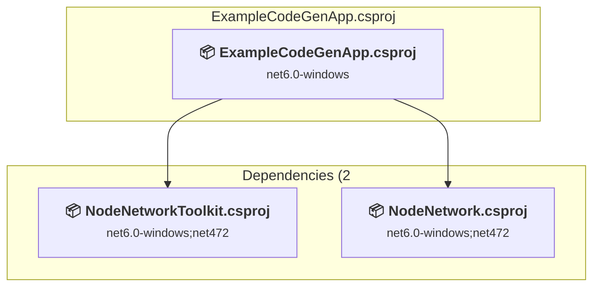

### API Compatibility

| Category | Count | Impact |
| :--- | :---: | :--- |
| 🔴 Binary Incompatible | 376 | High - Require code changes |
| 🟡 Source Incompatible | 0 | Medium - Needs re-compilation and potential conflicting API error fixing |
| 🔵 Behavioral change | 27 | Low - Behavioral changes that may require testing at runtime |
| ✅ Compatible | 2333 |  |
| ***Total APIs Analyzed*** | ***2736*** |  |

#### Project Technologies and Features

| Technology | Issues | Percentage | Migration Path |
| :--- | :---: | :---: | :--- |
| WPF (Windows Presentation Foundation) | 206 | 51,1% | WPF APIs for building Windows desktop applications with XAML-based UI that are available in .NET on Windows. WPF provides rich desktop UI capabilities with data binding and styling. Enable Windows Desktop support: Option 1 (Recommended): Target net9.0-windows; Option 2: Add <UseWindowsDesktop>true</UseWindowsDesktop>. |

### ExampleShaderEditorApp\ExampleShaderEditorApp.csproj

#### Project Info

- **Current Target Framework:** net6.0-windows
- **Proposed Target Framework:** net10.0-windows
- **SDK-style**: True
- **Project Kind:** Wpf
- **Dependencies**: 2
- **Dependants**: 0
- **Number of Files**: 48
- **Number of Files with Incidents**: 20
- **Lines of Code**: 2765
- **Estimated LOC to modify**: 261+ (at least 9,4% of the project)

#### Dependency Graph

Legend:
📦 SDK-style project
⚙️ Classic project

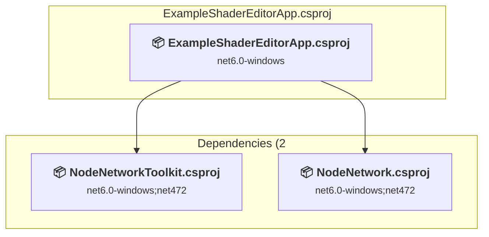

### API Compatibility

| Category | Count | Impact |
| :--- | :---: | :--- |
| 🔴 Binary Incompatible | 221 | High - Require code changes |
| 🟡 Source Incompatible | 21 | Medium - Needs re-compilation and potential conflicting API error fixing |
| 🔵 Behavioral change | 19 | Low - Behavioral changes that may require testing at runtime |
| ✅ Compatible | 3627 |  |
| ***Total APIs Analyzed*** | ***3888*** |  |

#### Project Technologies and Features

| Technology | Issues | Percentage | Migration Path |
| :--- | :---: | :---: | :--- |
| GDI+ / System.Drawing | 19 | 7,3% | System.Drawing APIs for 2D graphics, imaging, and printing that are available via NuGet package System.Drawing.Common. Note: Not recommended for server scenarios due to Windows dependencies; consider cross-platform alternatives like SkiaSharp or ImageSharp for new code. |
| Windows Forms | 28 | 10,7% | Windows Forms APIs for building Windows desktop applications with traditional Forms-based UI that are available in .NET on Windows. Enable Windows Desktop support: Option 1 (Recommended): Target net9.0-windows; Option 2: Add <UseWindowsDesktop>true</UseWindowsDesktop>; Option 3 (Legacy): Use Microsoft.NET.Sdk.WindowsDesktop SDK. |
| WPF (Windows Presentation Foundation) | 102 | 39,1% | WPF APIs for building Windows desktop applications with XAML-based UI that are available in .NET on Windows. WPF provides rich desktop UI capabilities with data binding and styling. Enable Windows Desktop support: Option 1 (Recommended): Target net9.0-windows; Option 2: Add <UseWindowsDesktop>true</UseWindowsDesktop>. |

### NodeNetwork.Blazor\NodeNetwork.Blazor.csproj

#### Project Info

- **Current Target Framework:** net10.0✅
- **SDK-style**: True
- **Project Kind:** ClassLibrary
- **Dependencies**: 0
- **Dependants**: 1
- **Number of Files**: 16
- **Lines of Code**: 520
- **Estimated LOC to modify**: 0+ (at least 0,0% of the project)

#### Dependency Graph

Legend:
📦 SDK-style project
⚙️ Classic project

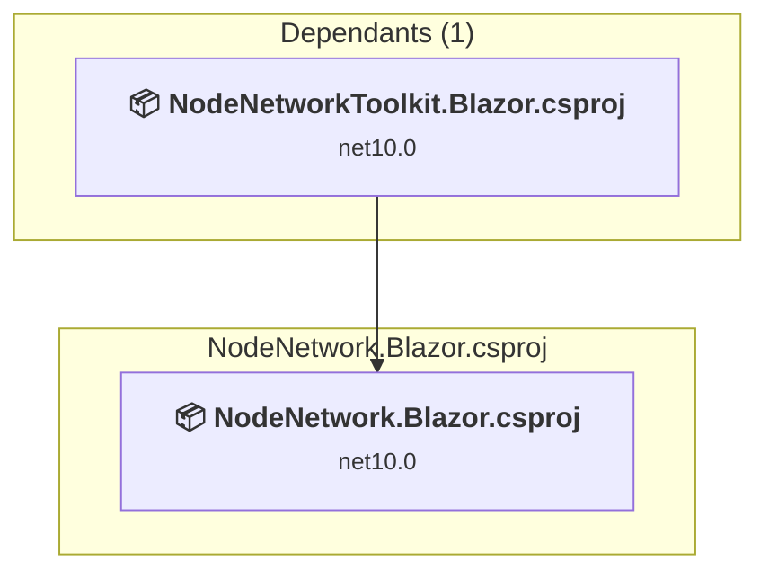

### API Compatibility

| Category | Count | Impact |
| :--- | :---: | :--- |
| 🔴 Binary Incompatible | 0 | High - Require code changes |
| 🟡 Source Incompatible | 0 | Medium - Needs re-compilation and potential conflicting API error fixing |
| 🔵 Behavioral change | 0 | Low - Behavioral changes that may require testing at runtime |
| ✅ Compatible | 0 |  |
| ***Total APIs Analyzed*** | ***0*** |  |

### NodeNetwork\NodeNetwork.csproj

#### Project Info

- **Current Target Framework:** net6.0-windows;net472
- **Proposed Target Framework:** net6.0-windows;net472;net10.0-windows
- **SDK-style**: True
- **Project Kind:** Wpf
- **Dependencies**: 0
- **Dependants**: 6
- **Number of Files**: 38
- **Number of Files with Incidents**: 30
- **Lines of Code**: 4925
- **Estimated LOC to modify**: 1614+ (at least 32,8% of the project)

#### Dependency Graph

Legend:
📦 SDK-style project
⚙️ Classic project

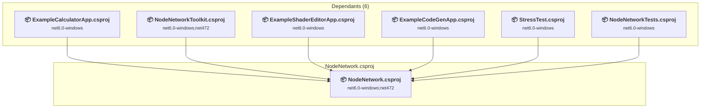

### API Compatibility

| Category | Count | Impact |
| :--- | :---: | :--- |
| 🔴 Binary Incompatible | 1608 | High - Require code changes |
| 🟡 Source Incompatible | 0 | Medium - Needs re-compilation and potential conflicting API error fixing |
| 🔵 Behavioral change | 6 | Low - Behavioral changes that may require testing at runtime |
| ✅ Compatible | 4265 |  |
| ***Total APIs Analyzed*** | ***5879*** |  |

#### Project Technologies and Features

| Technology | Issues | Percentage | Migration Path |
| :--- | :---: | :---: | :--- |
| WPF (Windows Presentation Foundation) | 587 | 36,4% | WPF APIs for building Windows desktop applications with XAML-based UI that are available in .NET on Windows. WPF provides rich desktop UI capabilities with data binding and styling. Enable Windows Desktop support: Option 1 (Recommended): Target net9.0-windows; Option 2: Add <UseWindowsDesktop>true</UseWindowsDesktop>. |

### NodeNetworkTests\NodeNetworkTests.csproj

#### Project Info

- **Current Target Framework:** net6.0-windows
- **Proposed Target Framework:** net10.0-windows
- **SDK-style**: True
- **Project Kind:** Wpf
- **Dependencies**: 2
- **Dependants**: 0
- **Number of Files**: 8
- **Number of Files with Incidents**: 1
- **Lines of Code**: 1446
- **Estimated LOC to modify**: 0+ (at least 0,0% of the project)

#### Dependency Graph

Legend:
📦 SDK-style project
⚙️ Classic project

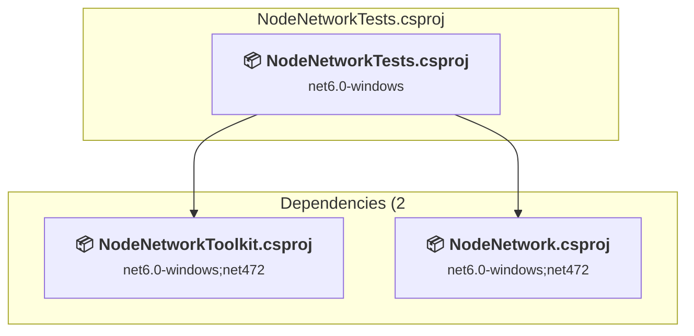

### API Compatibility

| Category | Count | Impact |
| :--- | :---: | :--- |
| 🔴 Binary Incompatible | 0 | High - Require code changes |
| 🟡 Source Incompatible | 0 | Medium - Needs re-compilation and potential conflicting API error fixing |
| 🔵 Behavioral change | 0 | Low - Behavioral changes that may require testing at runtime |
| ✅ Compatible | 2780 |  |
| ***Total APIs Analyzed*** | ***2780*** |  |

### NodeNetworkToolkit.Blazor\NodeNetworkToolkit.Blazor.csproj

#### Project Info

- **Current Target Framework:** net10.0✅
- **SDK-style**: True
- **Project Kind:** ClassLibrary
- **Dependencies**: 1
- **Dependants**: 0
- **Number of Files**: 19
- **Lines of Code**: 1878
- **Estimated LOC to modify**: 0+ (at least 0,0% of the project)

#### Dependency Graph

Legend:
📦 SDK-style project
⚙️ Classic project

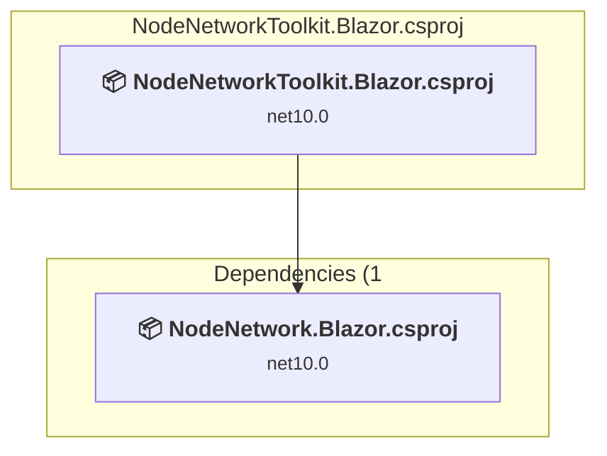

### API Compatibility

| Category | Count | Impact |
| :--- | :---: | :--- |
| 🔴 Binary Incompatible | 0 | High - Require code changes |
| 🟡 Source Incompatible | 0 | Medium - Needs re-compilation and potential conflicting API error fixing |
| 🔵 Behavioral change | 0 | Low - Behavioral changes that may require testing at runtime |
| ✅ Compatible | 0 |  |
| ***Total APIs Analyzed*** | ***0*** |  |

### NodeNetworkToolkit\NodeNetworkToolkit.csproj

#### Project Info

- **Current Target Framework:** net6.0-windows;net472
- **Proposed Target Framework:** net6.0-windows;net472;net10.0-windows
- **SDK-style**: True
- **Project Kind:** Wpf
- **Dependencies**: 1
- **Dependants**: 6
- **Number of Files**: 24
- **Number of Files with Incidents**: 17
- **Lines of Code**: 2926
- **Estimated LOC to modify**: 668+ (at least 22,8% of the project)

#### Dependency Graph

Legend:
📦 SDK-style project
⚙️ Classic project

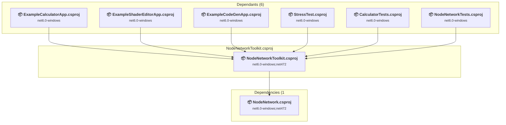

### API Compatibility

| Category | Count | Impact |
| :--- | :---: | :--- |
| 🔴 Binary Incompatible | 656 | High - Require code changes |
| 🟡 Source Incompatible | 4 | Medium - Needs re-compilation and potential conflicting API error fixing |
| 🔵 Behavioral change | 8 | Low - Behavioral changes that may require testing at runtime |
| ✅ Compatible | 2990 |  |
| ***Total APIs Analyzed*** | ***3658*** |  |

#### Project Technologies and Features

| Technology | Issues | Percentage | Migration Path |
| :--- | :---: | :---: | :--- |
| WPF (Windows Presentation Foundation) | 304 | 45,5% | WPF APIs for building Windows desktop applications with XAML-based UI that are available in .NET on Windows. WPF provides rich desktop UI capabilities with data binding and styling. Enable Windows Desktop support: Option 1 (Recommended): Target net9.0-windows; Option 2: Add <UseWindowsDesktop>true</UseWindowsDesktop>. |

### StressTest\StressTest.csproj

#### Project Info

- **Current Target Framework:** net6.0-windows
- **Proposed Target Framework:** net10.0-windows
- **SDK-style**: True
- **Project Kind:** Wpf
- **Dependencies**: 2
- **Dependants**: 0
- **Number of Files**: 6
- **Number of Files with Incidents**: 6
- **Lines of Code**: 294
- **Estimated LOC to modify**: 42+ (at least 14,3% of the project)

#### Dependency Graph

Legend:
📦 SDK-style project
⚙️ Classic project

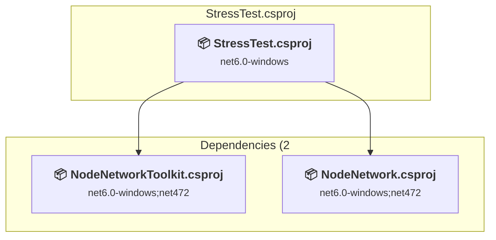

### API Compatibility

| Category | Count | Impact |
| :--- | :---: | :--- |
| 🔴 Binary Incompatible | 35 | High - Require code changes |
| 🟡 Source Incompatible | 2 | Medium - Needs re-compilation and potential conflicting API error fixing |
| 🔵 Behavioral change | 5 | Low - Behavioral changes that may require testing at runtime |
| ✅ Compatible | 187 |  |
| ***Total APIs Analyzed*** | ***229*** |  |

#### Project Technologies and Features

| Technology | Issues | Percentage | Migration Path |
| :--- | :---: | :---: | :--- |
| Legacy Configuration System | 2 | 4,8% | Legacy XML-based configuration system (app.config/web.config) that has been replaced by a more flexible configuration model in .NET Core. The old system was rigid and XML-based. Migrate to Microsoft.Extensions.Configuration with JSON/environment variables; use System.Configuration.ConfigurationManager NuGet package as interim bridge if needed. |
| WPF (Windows Presentation Foundation) | 11 | 26,2% | WPF APIs for building Windows desktop applications with XAML-based UI that are available in .NET on Windows. WPF provides rich desktop UI capabilities with data binding and styling. Enable Windows Desktop support: Option 1 (Recommended): Target net9.0-windows; Option 2: Add <UseWindowsDesktop>true</UseWindowsDesktop>. |

